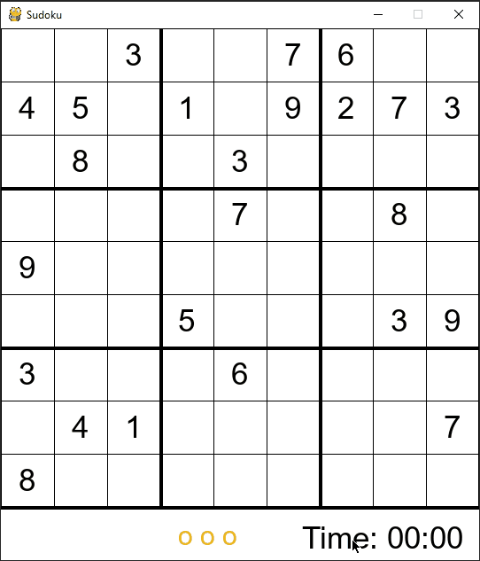

# Sudoku Solver

This is a sudoku game made using python. It uses a backtracking algorith to solve the board.

This project includes a Sudoku GUI made with pygame and a text-based Sudoku version that shows the backtracking algorithm. It also includes a generator file that shows how a new board gets created by randomly inserting numbers and using the backtracking algorithm.

To see the backtracking algorithm in action, simply press the spacebar to watch it go. Green boxes indicate a valid value was found. If the algorithm backtracks, the box will be marked red.

## Getting Started

Run GUI.py to play sudoku.

Click on any of the boxes and type a number 1-9 to pencil in a number. Press enter to confirm the penciled in number in the selected box. To delete a penciled in number, press DEL or backspace. 

You can get hints by pressing the h key. Hints are written in blue and add 30 second to your time. Each game gives three hints and three strikes. After three strikes, the game will end.

### Prerequisites

To run GUI.py, you must have pygame installed on your system. 

You can follow the [instructions here.](https://www.pygame.org/wiki/GettingStarted)

## Built With

* [Python](https://www.python.org/)

* [Pygame](https://www.pygame.org)
